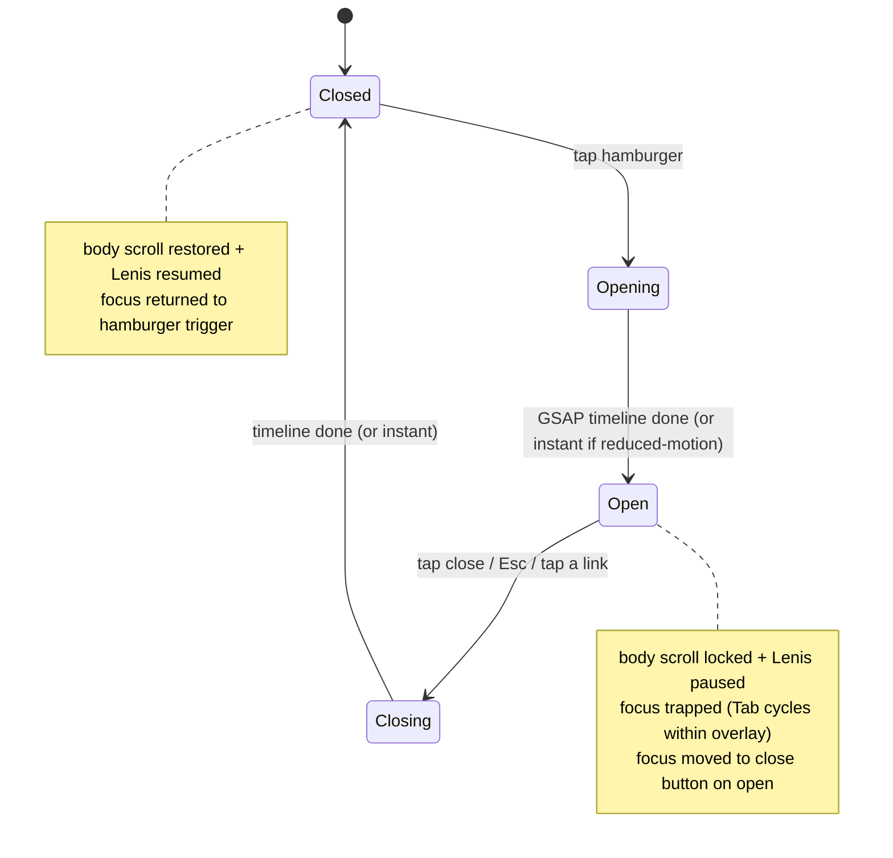
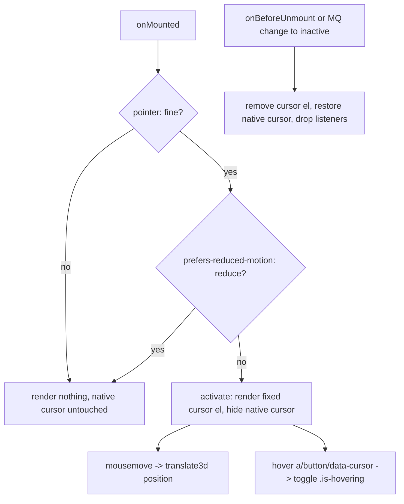

# feat: Chrome — dark nav, footer, custom cursor (PRO-110)

## Summary

Second of the six-cycle redesign. Cycle 1 (PRO-109) laid the dark-token + motion platform and left the existing chrome rendering dark **via remapped legacy tokens** but otherwise unstyled. This cycle restyles the global **chrome** intentionally against the new semantic tokens (`--ink`, `--raised`, `--paper`, `--dim`, `--faint`, `--accent`, `--hairline`) and adds the two interaction pieces the dark shell needs:

- `SiteNav.vue` — dark restyle that **preserves** the route-aware `links` computed, the `aria-current` logic, and the `is-scrolled` scroll listener, and **adds** a mobile full-screen overlay menu (GSAP open/close, focus-trap, Esc, body scroll lock, ≥44px targets).
- `SiteFooter.vue` — dark restyle, identical 4-column structure and links.
- `CustomCursor.vue` — a new global custom cursor, active only on `pointer: fine` and disabled on touch / reduced-motion, reacting to `a`/`button`/`[data-cursor]` hover, mounted in the default layout.
- `chrome.css` — dark nav + footer styles plus the overlay + hamburger CSS, authored against the new semantic tokens.

No section/page-content restyle happens here — only the chrome and the global cursor. Cycles 3–6 restyle hero, sections, and pages.

---

## Problem Frame

After PRO-109 the nav and footer are legible-on-dark only because `tokens.css` remapped the old `--color-*` names to dark values (`--color-pitch-black → --paper`, `--color-canvas-white → --ink`, etc.). That is a survival hack, not a designed dark chrome: the rules still read as the inverted light system, hover/active treatments were tuned for light, and there is no mobile menu affordance beyond hiding the "About" link at narrow widths (the bar just wraps). The dark redesign also wants a custom cursor as a signature interaction.

The central tension: **restyle the chrome and add interaction without regressing the load-bearing nav contract.** `SiteNav.vue` owns three behaviors that other parts of the system and the existing test depend on — the route-aware `links` computed (in-page anchors on `/`, cross-route anchors on `/consulting`), the `aria-current="page"` painting, and the passive `is-scrolled` scroll listener. These must survive verbatim in behavior. The new overlay, hamburger, cursor, and CSS layer on top; they do not replace that contract.

A secondary tension: the cursor and overlay are **client-only, capability-gated** behaviors in an SSR/prerendered (`nuxt generate`) app. They must be SSR-safe (no `window` at module/render time), must not shift layout, and must respect `prefers-reduced-motion` and pointer type — reusing the PRO-109 `useReducedMotion()` composable and matching its SSR-safe pattern for pointer detection.

---

## Requirements

Traced from the PRO-110 brief and acceptance criteria.

- **R1** — `SiteNav.vue`: dark restyle using the new semantic tokens; **preserve** the route-aware `links` computed (Experiments/About flip in-page vs cross-route anchor on `route.path === '/consulting'`), the `aria-current="page"` logic, and the `is-scrolled` scroll listener (`onMounted`/`onBeforeUnmount`, passive).
- **R2** — `SiteNav.vue`: add a mobile full-screen overlay menu — hamburger/close toggle button, GSAP open/close animation that **degrades to an instant toggle under reduced motion**, focus-trap while open, Esc to close, body scroll lock while open, restore scroll + focus on close. All interactive targets ≥44px.
- **R3** — `SiteFooter.vue`: dark restyle, same 4-column content (Brand / Site / Contact / Elsewhere) and all existing links + anchors (`/#work`, `/consulting`, `/#about`, `mailto:claudioccm@gmail.com`, GitHub, X/Twitter, `https://ccmdesign.com`, `https://squoosh.ccmdesign.com`).
- **R4** — `CustomCursor.vue`: a new global custom cursor active only on `pointer: fine`, hidden on touch **and** when `prefers-reduced-motion: reduce`; reacts to hover over `a`, `button`, and `[data-cursor]` elements; mounted globally in `app/layouts/default.vue`; SSR-safe; no layout shift.
- **R5** — `chrome.css`: update nav + footer rules for the dark restyle and add overlay + hamburger + cursor-hide styles, all authored against the new semantic tokens (`--ink`/`--raised`/`--paper`/`--dim`/`--faint`/`--accent`/`--hairline`), not the legacy `--color-*` aliases.
- **R6** — `tests/SiteNav.spec.ts`: update to match the new structure; still assert the route-aware href branching (extend the existing harness-based spec).
- **R7** — Accessibility: nav + footer text legible at AAA where it is body/label text; native scroll restoration and focus management on overlay close; keyboard operability of hamburger + overlay.
- **R8** — Quality gate: `pnpm typecheck`, `pnpm lint`, `pnpm test`, and `pnpm generate` all green.

---

## Key Technical Decisions

- **Author against the new semantic tokens, not the legacy aliases.** `chrome.css` currently consumes `--color-canvas-white` / `--color-pitch-black` / `--color-stone-accent` / `--color-ash-text`. This cycle rewrites the nav + footer rules to consume `--ink` / `--raised` / `--paper` / `--dim` / `--faint` / `--hairline` / `--accent` directly. The legacy aliases stay defined in `tokens.css` (other unstyled sections still use them) — we just stop using them in chrome. This is the explicit intent of cycle 2: turn the survival-remap into a designed surface.
- **Nav background.** Use `--ink` (page bg) for the resting nav so it reads as part of the canvas, with the `is-scrolled` state adding a `--hairline` bottom border (mirrors the existing `is-scrolled` border behavior, dark-appropriate). Keep the nav `position: sticky`. Optionally a faint `--raised`/translucent treatment on scroll; default to the simplest legible option (ink bg + hairline border on scroll) and note any richer treatment as deferred.
- **Mobile overlay lives inside `SiteNav.vue`.** The overlay is nav state, so the hamburger button, `isMenuOpen` ref, GSAP timeline, focus-trap, Esc handler, and scroll-lock all live in `SiteNav.vue`. The same route-aware `links` array renders both the desktop `ul.nav-links` and the overlay list — one source of truth, no duplicated href logic. Desktop nav (≥ the overlay breakpoint) renders the inline links and hides the hamburger; mobile renders the hamburger and the overlay, hides the inline links.
- **Overlay breakpoint.** Use a single breakpoint (default `768px`) below which the inline links are replaced by the hamburger + overlay. The existing `640px`/`480px` tweaks in `chrome.css` are superseded by the overlay for the hidden-links case; keep or simplify them as needed but do not regress the wordmark layout.
- **GSAP via `useNuxtApp().$gsap`, reduced-motion aware.** Open/close animates the overlay (e.g. fade/slide + stagger the links) through the provided `$gsap`. When `useReducedMotion()` is `true`, skip the timeline and toggle visibility instantly. GSAP is client-only (`gsap.client.ts`), so all GSAP access is inside `onMounted`/event handlers, never at setup top-level in a way that runs on the server.
- **Focus-trap + scroll-lock: hand-rolled, minimal.** No new dependency. On open: record the trigger element, move focus into the overlay (first focusable / close button), add a `keydown` handler that (a) closes on `Escape` and (b) cycles Tab/Shift+Tab within the overlay's focusable set; lock body scroll by toggling a class that sets `overflow: hidden` on a scroll container (and, if Lenis is running, stop it). On close: restore `overflow`, restart Lenis if it was running, return focus to the trigger. Tear everything down in `onBeforeUnmount`.
- **Lenis interaction.** The PRO-109 Lenis plugin owns smooth scroll. Body scroll-lock must also pause Lenis so the page behind the overlay cannot scroll. Access Lenis via the same Nuxt-app provide the plugin exposes (confirm the provide key at implementation time); if no programmatic handle is exposed, fall back to a CSS `overflow: hidden` lock on the scroll root and document the choice. **Deferred to implementation:** exact Lenis stop/start handle.
- **CustomCursor capability gate, SSR-safe.** The component renders nothing meaningful on the server and only activates in `onMounted` when **both** `matchMedia('(pointer: fine)').matches` is true **and** `useReducedMotion()` is false. When inactive it renders no cursor element and does not touch the native cursor — zero layout shift, zero behavior change on touch/reduced-motion. When active it renders a fixed, `pointer-events: none` element positioned via `transform: translate3d(...)` on `mousemove` (GSAP `quickTo` or a rAF), and adds/removes a "hover" state when the event target matches `a, button, [data-cursor]`. Native cursor hidden via a body class only while active.
- **No CustomCursor unit test.** It is pure client-only DOM/visual behavior with no extractable pure logic worth a harness; gate it behind browser testing (Step 6) instead. Mark its test expectation as `none` with that reason. The SiteNav route-aware logic remains unit-tested.

---

## High-Level Technical Design

### SiteNav overlay state machine (mobile)

### CustomCursor activation gate

These two pieces are the only non-obvious behavior in the cycle; the footer and the desktop nav are straight CSS restyles of existing markup.

---

## Implementation Units

### U1. SiteNav dark restyle + mobile overlay menu

**Goal:** Restyle the nav dark against the new semantic tokens and add the mobile full-screen overlay menu, without regressing the existing route-aware / aria-current / is-scrolled contract.

**Requirements:** R1, R2, R5 (nav portion), R7.

**Dependencies:** none (builds on PRO-109 foundation already on `dev`).

**Files:**
- `app/components/SiteNav.vue` (modify)
- `app/assets/css/chrome.css` (modify — nav + overlay + hamburger rules)

**Approach:**
- Keep the `<script setup lang="ts">` block's existing `links` computed, `isConsulting`, `isScrolled`, and the `onMounted`/`onBeforeUnmount` scroll listener **verbatim in behavior**. Add new state: `isMenuOpen` ref, refs for the overlay element / close button / hamburger, the trigger element, and a GSAP timeline handle.
- Add a hamburger `<button>` (visible < overlay breakpoint, `aria-expanded`, `aria-controls` pointing at the overlay, accessible label that flips open/close) and the overlay `<nav>`/`<ul>` rendering the **same** `links` array. Desktop inline `ul.nav-links` stays for ≥ breakpoint.
- Open/close: build a GSAP timeline via `useNuxtApp().$gsap` inside the handler (client-only). When `useReducedMotion()` is true, set final state instantly without a timeline. On open: move focus to the close button, install a `keydown` handler (Esc closes; Tab/Shift+Tab cycle within the overlay's focusable set), lock body scroll (class toggle + pause Lenis if a handle is exposed). On close: reverse animation, restore scroll/Lenis, return focus to the hamburger. Tapping any overlay link also closes the menu.
- Tear down keydown handler, restore scroll, and kill any live timeline in `onBeforeUnmount`.
- CSS: nav bg `--ink`; `is-scrolled` adds a `--hairline` bottom border; links use `--paper` with `--accent` (or underline) hover/active; `aria-current` underline retained, re-tuned for dark; hamburger lines + overlay panel (`--ink`/`--raised` bg, `--paper` links) authored against semantic tokens; all targets ≥44px; overlay covers the viewport (`position: fixed; inset: 0`) and is non-interactive/hidden when closed.

**Patterns to follow:** existing `SiteNav.vue` script structure and `chrome.css` `.nav` / `.nav-links` rules; `useReducedMotion()` from `app/composables/useReducedMotion.ts`; `$gsap` provide from `app/plugins/gsap.client.ts`.

**Execution note:** Verify the existing route-aware/aria-current/is-scrolled behavior is byte-for-byte unchanged in intent before layering overlay state on top — the spec in U4 guards the href branching.

**Test scenarios:**
- Covered behaviorally by U4 (href branching) at the unit level and by Step 6 browser tests (overlay open/close/trap/scroll-lock/Esc, desktop unchanged). No new pure logic in this unit beyond the existing computed.
- Test expectation: the route-aware `links` computed remains asserted by `tests/SiteNav.spec.ts` (U4); overlay interaction is browser-tested (no Vitest harness for GSAP/focus-trap DOM).

**Verification:** Desktop nav renders inline links, hamburger hidden; below breakpoint the hamburger shows and the overlay opens/closes with focus-trap, Esc, scroll-lock, and focus restore; `aria-current` still paints the active route; `is-scrolled` border still toggles on scroll; no console errors; typecheck/lint clean.

---

### U2. SiteFooter dark restyle

**Goal:** Restyle the footer dark against the new semantic tokens while preserving its exact 4-column structure and every link/anchor.

**Requirements:** R3, R5 (footer portion), R7.

**Dependencies:** none.

**Files:**
- `app/components/SiteFooter.vue` (modify — likely template unchanged; classes/markup only if needed)
- `app/assets/css/chrome.css` (modify — footer rules)

**Approach:**
- Keep the template's 4 columns (Brand / Site / Contact / Elsewhere), the `footer-meta` row, the wordmark, and **all** links: `/#work`, `/consulting`, `/#about`, `mailto:claudioccm@gmail.com`, GitHub, X/Twitter, `https://ccmdesign.com`, `https://squoosh.ccmdesign.com`.
- CSS: footer bg `--ink` (or `--raised` if the design wants a subtle lift — default `--ink` to match the nav/canvas), top border `--hairline`; `h4` labels `--dim`/`--faint` but kept at AAA-passing contrast for body-size text; links `--paper` with `--dim`/`--accent` hover; `footer-meta` text `--faint`; glyph `--paper` or `--accent`. Authored against semantic tokens, replacing the legacy `--color-*` references in the current footer block.
- Preserve the existing ≥44px tap-target rules and the responsive grid collapse (`800px` → 2-col, `480px` → 1-col).

**Patterns to follow:** existing `SiteFooter.vue` template and the `.footer*` rules in `chrome.css`.

**Test scenarios:**
- Test expectation: none — pure styling change to static markup, no behavioral logic. Legibility/contrast and link resolution are verified in Step 6 browser tests.

**Verification:** Footer renders dark and legible on home and `/consulting`; all links present and resolving; AAA contrast on text where applicable; responsive collapse intact; typecheck/lint clean.

---

### U3. CustomCursor component + global mount

**Goal:** Add a capability-gated, SSR-safe custom cursor that activates only on fine pointers (and not under reduced motion), reacts to interactive-element hover, and causes no layout shift.

**Requirements:** R4, R5 (cursor-hide CSS portion), R7.

**Dependencies:** none.

**Files:**
- `app/components/CustomCursor.vue` (create)
- `app/layouts/default.vue` (modify — mount `<CustomCursor />` globally)
- `app/assets/css/chrome.css` (modify — cursor element + `.cursor-active` native-cursor-hide rules; or scoped styles in the component, decided at implementation)

**Approach:**
- `<script setup lang="ts">`: keep all `window`/`matchMedia` access inside `onMounted`. Compute active = `matchMedia('(pointer: fine)').matches && !useReducedMotion().value`. Listen for pointer-type and reduced-motion MQ changes to activate/deactivate live; clean up in `onBeforeUnmount`.
- When active: render a fixed, `pointer-events: none`, `aria-hidden` element; move it on `mousemove` via `transform: translate3d(x, y, 0)` (use `$gsap.quickTo` if convenient, else a rAF-throttled handler); toggle an `.is-hovering` class when `event.target.closest('a, button, [data-cursor]')` matches; add a body class that hides the native cursor only while active.
- When inactive: render nothing, do not add the body class, do not attach `mousemove` — zero layout shift, native cursor untouched on touch/reduced-motion.
- Mount once in `app/layouts/default.vue` (alongside `GrainOverlay`), outside `<main>` so it's global. Position it so it does not affect document flow (fixed, top layer, non-interactive).

**Patterns to follow:** `app/components/GrainOverlay.vue` (fixed, non-interactive, SSR-safe global overlay) for the mount + SSR-safety pattern; `useReducedMotion()` composable; `$gsap` provide.

**Test scenarios:**
- Test expectation: none at the unit level — behavior is client-only DOM/visual with no extractable pure logic worth a Vitest harness. Activation gate (present on fine pointer; absent on touch + reduced-motion), hover reaction, and no-layout-shift are verified in Step 6 browser tests.

**Verification:** On a fine-pointer non-reduced-motion browser the cursor element exists, tracks the pointer, and reacts on `a`/`button`/`[data-cursor]` hover; emulating touch OR reduced-motion yields no cursor element and the native cursor intact; no layout shift (no scrollbars/overflow introduced); `nuxt generate` produces no SSR `window` errors; typecheck/lint clean.

---

### U4. Update SiteNav spec for the new structure

**Goal:** Keep the unit test green and meaningful against the restyled nav — still asserting the route-aware href branching, extended for any new structure introduced in U1.

**Requirements:** R6, R8.

**Dependencies:** U1.

**Files:**
- `tests/SiteNav.spec.ts` (modify)

**Approach:**
- The current spec uses a harness component that re-implements the `links` computed and asserts the in-page vs cross-route branching on `/` vs `/consulting`. Keep that approach. If U1 changes the `NavLink` shape or the link set, mirror the change in the harness so the assertions track the real component. Do **not** weaken the existing assertions: Experiments/About flip on `/consulting`; Consulting/Contact hrefs stable across routes.
- If U1 adds menu-open state that is unit-testable as pure logic (e.g. a derived `menuLabel`/`aria-expanded` value), add a small assertion for it. Otherwise leave overlay behavior to browser tests and keep the spec focused on the href contract.

**Patterns to follow:** the existing harness in `tests/SiteNav.spec.ts`.

**Test scenarios:**
- Happy path: on `/`, Experiments href is `#work`, About href is `#about` (in-page anchors).
- Happy path: on `/consulting`, Experiments href is `/#work`, About href is `/#about` (cross-route anchors).
- Stability: Consulting href is `/consulting` and Contact href is `#contact` on both routes.
- (If applicable) any new pure-logic derived value introduced by U1.

**Verification:** `pnpm test` green with the route-aware branching still asserted; no reduction in the existing coverage.

---

## Scope Boundaries

**In scope:** dark restyle of `SiteNav` + `SiteFooter`; mobile overlay menu; global `CustomCursor`; `chrome.css` dark + overlay + hamburger + cursor rules against semantic tokens; `tests/SiteNav.spec.ts` update.

**Out of scope (other cycles):** hero, sections, page content, and the home/consulting page bodies (cycles 3–6); any change to `sections.css` beyond what chrome requires (none expected); WebGL/Three.js work; copy changes.

### Deferred to Follow-Up Work
- Exact Lenis programmatic stop/start handle for scroll-lock — resolve at implementation by inspecting the PRO-109 `lenis.client.ts` provide; fall back to a CSS `overflow: hidden` lock if no handle is exposed, and document the choice in the browser-test solution note.
- Any richer scrolled-nav treatment (translucent/blur background) beyond ink-bg + hairline-border — keep the simplest legible option this cycle; richer treatment can land in a later polish pass if desired.
- Removing the now-superseded `640px`/`480px` link-hiding tweaks in `chrome.css` if the overlay fully replaces them — simplify only if it does not regress the wordmark layout.

---

## System-Wide Impact

- **Global chrome:** every page uses `SiteNav` + `SiteFooter` via `app/layouts/default.vue`, so both pages (home, `/consulting`) are affected — verify both.
- **Global cursor:** `CustomCursor` mounts in the layout, so it is present site-wide; the capability gate must guarantee it is inert on touch/reduced-motion everywhere.
- **Tokens:** no change to `tokens.css`; this cycle only changes which tokens `chrome.css` consumes. Legacy `--color-*` aliases remain in use by not-yet-restyled `sections.css`.
- **Motion stack:** reuses PRO-109's `$gsap` provide, `useReducedMotion()`, and Lenis; no new dependencies.

---

## Risks & Dependencies

- **Regressing the nav contract.** Mitigation: preserve the `links` computed / `aria-current` / `is-scrolled` behavior verbatim; U4 spec guards the href branching; Step 6 browser-tests desktop nav unchanged.
- **SSR / `nuxt generate` errors from client-only APIs.** Mitigation: all `window`/`matchMedia`/GSAP access inside `onMounted`/handlers; mirror GrainOverlay's SSR-safe pattern; `pnpm generate` is part of the gate.
- **Layout shift from the cursor or overlay.** Mitigation: cursor is fixed + `pointer-events: none` and renders nothing when inactive; overlay is fixed `inset: 0`; verify no scrollbar/overflow introduced.
- **Scroll-lock fighting Lenis.** Mitigation: pause Lenis on open / resume on close if a handle exists, else CSS overflow lock; documented as a deferred implementation detail.
- **Focus-trap correctness.** Mitigation: hand-rolled trap moves focus in on open, cycles within the overlay, restores to trigger on close; browser-tested.

---

## Sources & Research

- Origin foundation plan: `docs/plans/2026-06-13-001-feat-foundation-dark-motion-plan.md` (PRO-109) — token names, motion stack, composables.
- Existing code read directly: `app/components/SiteNav.vue`, `app/components/SiteFooter.vue`, `app/layouts/default.vue`, `app/components/GrainOverlay.vue`, `app/assets/css/chrome.css`, `app/assets/css/tokens.css`, `app/composables/useReducedMotion.ts`, `app/plugins/gsap.client.ts`, `tests/SiteNav.spec.ts`.
- No external research required — this is a focused restyle + two well-understood client-only interaction patterns on an established stack.
